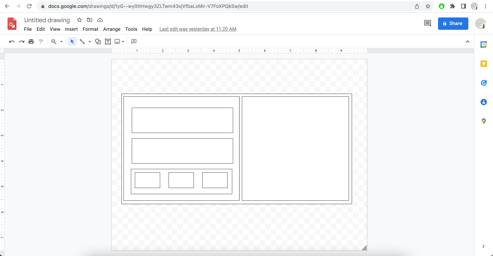
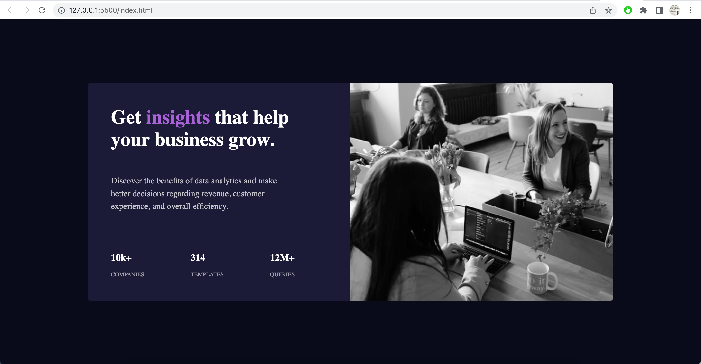
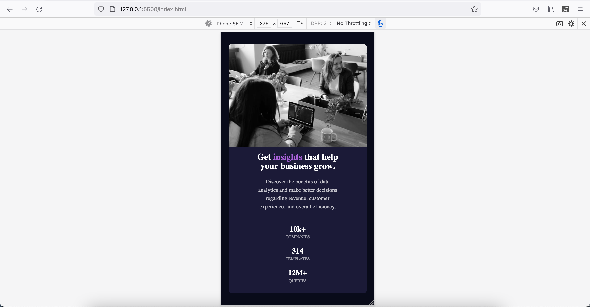

# Frontend Mentor - Stats preview card component solution

This is a solution to the [Stats preview card component challenge on Frontend Mentor](https://www.frontendmentor.io/challenges/stats-preview-card-component-8JqbgoU62). Frontend Mentor challenges help you improve your coding skills by building realistic projects.

## Table of contents

- [Overview](#overview)
  - [The challenge](#the-challenge)
  - [Screenshot](#screenshot)
  - [Links](#links)
- [My process](#my-process)
  - [Built with](#built-with)
  - [What I learned](#what-i-learned)
  - [Continued development](#continued-development)
  - [Useful resources](#useful-resources)
- [Author](#author)
- [Acknowledgments](#acknowledgments)

## Overview

This is 4th project to sharpen HTML & CSS skills along with responsive web design. It's great project for begineers to build their confidence gradually.

### The challenge

Users should be able to:

- View the optimal layout depending on their device's screen size

### Screenshot

### Links

- [Solution URL ](https://github.com/vikramvi/Stats-preview-card-component)
- [Live Site URL ](https://vikramvi.github.io/Stats-preview-card-component/)

## My process

### Built with

- Semantic HTML5 markup
- CSS
- Flexbox
- Mobile-second workflow

### What I learned

- Revision of HTML, CSS, Responsive web design
- Managing image sizes

### Continued development

- I wish to learn more about SEO, Accessibility
- Building responsive web design with less trial and error, with more confidence

### Useful resources

- NA

## Author

- Frontend Mentor - [@vikramvi](https://www.frontendmentor.io/profile/vikramvi)

## Acknowledgments

- Frontend Mentor community
- open source community
- YT mentors
